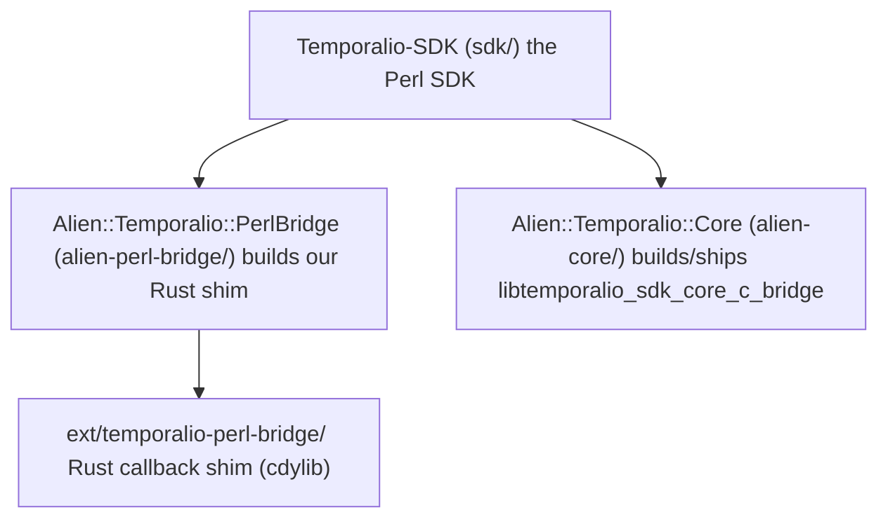

# Temporal SDK for Perl

A [Temporal](https://temporal.io) SDK for Perl. It drives the Rust
`sdk-core` through its C ABI (`temporalio-sdk-core-c-bridge`) via
[FFI::Platypus](https://metacpan.org/pod/FFI::Platypus), with an
async surface built on [Future::AsyncAwait](https://metacpan.org/pod/Future::AsyncAwait)
over [IO::Async](https://metacpan.org/pod/IO::Async).

> **Status: pre-1.0.** The public API is taking shape against the
> implementation contract in [`spec.md`](spec.md). Expect changes.

## What's in this repository

This is a monorepo of three layered Dist::Zilla distributions plus the
Rust callback shim they depend on:



| Path                  | Distribution                     | Role |
|-----------------------|----------------------------------|------|
| `alien-core/`         | `Alien::Temporalio::Core`        | Builds/ships `libtemporalio_sdk_core_c_bridge` from a pinned `sdk-rust` tag. |
| `alien-perl-bridge/`  | `Alien::Temporalio::PerlBridge`  | Builds our in-tree Rust shim (`ext/temporalio-perl-bridge/`). |
| `sdk/`                | `Temporalio-SDK`                 | The Perl SDK: client, worker, workflows, activities, converters. |
| `ext/temporalio-perl-bridge/` | (Rust crate)             | Trampolines that marshal sdk-core's Tokio-thread callbacks onto a per-runtime queue the Perl event loop drains — the interpreter is never touched off the main thread. |

Protobuf support is the pure-Perl
[`Protobuf`](https://github.com/MasonEgger/protobuf-perl) distribution:
the vendored proto trees in `sdk/share/proto/` are parsed directly (no
`protoc`, no `libprotobuf`), and the message classes are generated at
runtime under `Temporalio::Proto::*`.

## Requirements

- **Perl 5.38.0 or newer.** This is where `feature 'class'` landed; the
  SDK uses it pervasively. 5.38 ships in Ubuntu 24.04 LTS and Alpine
  3.20. CI runs 5.38, 5.40, and 5.42.
- **A Rust toolchain** (`stable`, 1.80+) via [rustup](https://rustup.rs),
  to build the native libraries at install time.
- A C toolchain (for `FFI::Platypus` and the cdylib builds).

### Platform notes

- **RHEL / CentOS Stream 9** ship Perl 5.32 (frozen, EOL 2032) — too old.
  Use [Software Collections](https://www.softwarecollections.org/) or
  [perlbrew](https://perlbrew.pl/) to get a 5.38+ Perl.
- **macOS** system Perl is 5.34 and Apple has signalled it will be
  removed. Install a current Perl with `perlbrew`, `plenv`, or Homebrew
  (`brew install perl`). Both Intel (x86_64) and Apple Silicon (arm64)
  are supported.
- **Windows** is best-effort (a non-blocking CI job runs Strawberry Perl);
  it is not yet a supported target.

## Installation

There is no CPAN release yet. Install the three distributions from git, in
dependency order, with [`cpanm`](https://metacpan.org/pod/App::cpanminus):

```bash
cpanm git+https://github.com/temporalio/sdk-perl.git#main/alien-core
cpanm git+https://github.com/temporalio/sdk-perl.git#main/alien-perl-bridge
cpanm git+https://github.com/temporalio/sdk-perl.git#main/sdk
```

The first command builds `sdk-core` from the pinned `sdk-rust` tag, which
takes a few minutes. To build against a local `sdk-rust` checkout instead
of fetching the tag, set `ALIEN_TEMPORALIO_CORE_SDK_RUST_PATH` to its
path before installing.

## Quickstart

Start a local Temporal server with the [`temporal`
CLI](https://docs.temporal.io/cli):

```bash
temporal server start-dev
```

Define a workflow and an activity as `feature 'class'` definitions:

```perl
# GreetingWorkflow.pm
use v5.38;
use feature 'class';
no warnings 'experimental::class';
use Future::AsyncAwait;
use Temporalio::Workflow;
use Temporalio::Workflow::Definition;

class GreetingWorkflow :isa(Temporalio::Workflow::Definition) {
    async method run :Run('GreetingWorkflow') ($name = 'World') {
        return await Temporalio::Workflow::execute_activity(
            'SayHello',
            args                   => [$name],
            start_to_close_timeout => 30,
        );
    }
}
1;
```

```perl
# Activities.pm
use v5.38;
use feature 'class';
no warnings 'experimental::class';
use Future::AsyncAwait;
use Temporalio::Activity::Definition;

class Activities :isa(Temporalio::Activity::Definition) {
    async method say_hello :Defn('SayHello') ($name) {
        return "Hello, $name!";
    }
}
1;
```

Run a worker to poll a task queue, then start the workflow:

```perl
use v5.38;
use Future::AsyncAwait;
use IO::Async::Loop;
use Temporalio::Runtime;
use Temporalio::Client;
use Temporalio::Worker;

my $loop    = IO::Async::Loop->new;
my $runtime = Temporalio::Runtime->new(loop => $loop);

my $client = $loop->await(
    Temporalio::Client->connect('localhost:7233', namespace => 'default', runtime => $runtime)
)->get;

# In the worker process:
my $worker = Temporalio::Worker->new(
    client     => $client,
    task_queue => 'hello-world',
    workflows  => ['GreetingWorkflow'],
    activities => ['Activities'],
);
$loop->await($worker->run)->get;

# In the starter process:
my $result = $loop->await(
    $client->execute_workflow('GreetingWorkflow', ['Alice'],
        id => 'hello-world-Alice', task_queue => 'hello-world')
)->get;
say $result;    # Hello, Alice!
```

A complete, runnable version (with a separate worker and starter) lives in
[`sdk/examples/hello-world/`](sdk/examples/hello-world/).

## Development

```bash
cd sdk && prove -lj4 t          # full Perl test suite
cd sdk && prove -lj4 xt         # author tests (POD coverage + syntax)
cd ext/temporalio-perl-bridge && cargo test   # Rust shim tests
dzil test                       # per-distribution check
```

Integration tests under `sdk/t/integration/` `skip_all` when the
`temporal` CLI / dev server is unavailable, so a green offline run is
expected.

## License

MIT. Copyright Temporal Technologies Inc.
