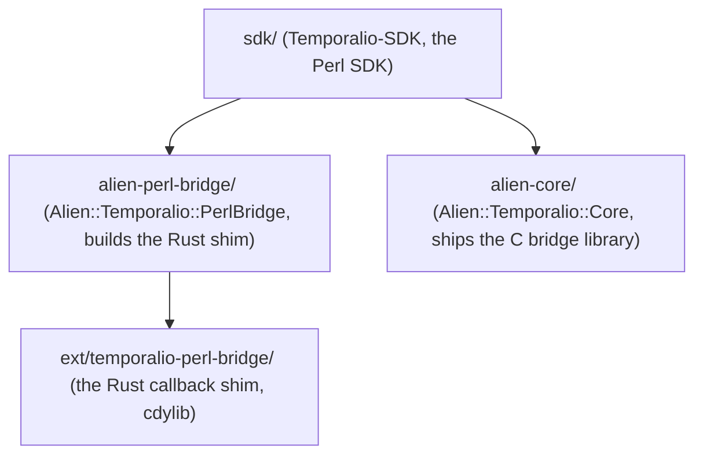

# Temporal SDK for Perl

[](https://github.com/MasonEgger/sdk-perl/actions/workflows/ci.yml)

> Larry wept.

A [Temporal](https://temporal.io) SDK for Perl. [Temporal](https://docs.temporal.io)
is a durable execution platform that lets you write applications that recover from
failure by default: your workflow code is plain Perl, but its state and progress are
persisted by the Temporal server, so it survives process crashes, restarts, and
deploys without losing its place.

This SDK drives the Rust `sdk-core` through its C ABI
(`temporalio-sdk-core-c-bridge`) via [FFI::Platypus](https://metacpan.org/pod/FFI::Platypus),
with an async surface built on [Future::AsyncAwait](https://metacpan.org/pod/Future::AsyncAwait)
over [IO::Async](https://metacpan.org/pod/IO::Async). Workflows run in a custom
deterministic scheduler that resolves their futures from server activations rather
than from wall-clock timers.

Runnable per-feature samples live in the
[samples-perl](https://github.com/MasonEgger/samples-perl) repository.

> **Status: pre-1.0 (v0.2 line).** The v0.1 and v0.2 feature sets (client,
> worker, sync/async activities, and workflows with signals, queries, updates,
> timers, cancellation, continue-as-new, child workflows, external handles,
> local activities, schedules, Nexus, interceptors, and worker hardening) are
> implemented and verified live against a dev server. A 97-requirement
> remediation and reference-SDK parity cycle (R1-R97, the root
> [`spec.md`](spec.md)) completed 2026-07-10, covering memory safety,
> cancellation semantics, the codec surface, the full interceptor surface, and
> Python-parity features. The suites are green at 859 tests across 197 files,
> including live dev-server integration, plus 462 author tests. Known
> follow-ups are tracked as GitHub issues. The public API is pre-1.0 and may
> still change before a 1.0 release; expect breaking changes.

**Contents**

- [Quick Start](#quick-start)
- [Repository layout](#repository-layout)
- [Usage](#usage)
  - [Client](#client)
  - [Workers](#workers)
  - [Workflows](#workflows)
  - [Activities](#activities)
  - [Common types](#common-types)
  - [Interceptors](#interceptors)
  - [Nexus](#nexus)
  - [Telemetry](#telemetry)
  - [Testing](#testing)
- [Not yet supported](#not-yet-supported)
- [Requirements](#requirements)
- [Development](#development)
- [License](#license)

## Quick Start

### Installation

There is no CPAN release yet. Install the three distributions from git, in
dependency order, with [`cpanm`](https://metacpan.org/pod/App::cpanminus):

```bash
cpanm git+https://github.com/MasonEgger/sdk-perl.git#main/alien-core
cpanm git+https://github.com/MasonEgger/sdk-perl.git#main/alien-perl-bridge
cpanm git+https://github.com/MasonEgger/sdk-perl.git#main/sdk
```

The first command builds `sdk-core` from a pinned `sdk-rust` tag and takes a few
minutes (a Rust `stable` toolchain is required). To build against a local
`sdk-rust` checkout instead of fetching the tag, set
`ALIEN_TEMPORALIO_CORE_SDK_RUST_PATH` to its path before installing. See
[Requirements](#requirements) for supported Perl versions and platforms.

### Implementing a Workflow and Activity

Workflows and activities are `feature 'class'` definitions. An **activity** is an
ordinary method (it may do I/O, call services, and fail) marked with `:Defn`:

```perl
# Activities.pm
use v5.38;
use feature 'class';
no warnings 'experimental::class';
use Future::AsyncAwait;
use Temporalio::Activity::Definition;

class Activities :isa(Temporalio::Activity::Definition) {
    async method say_hello :Defn('SayHello') ($name) {
        return "Hello, $name!";
    }
}
1;
```

A **workflow** is deterministic orchestration code. Its `:Run` method is the entry
point; it calls activities (and uses timers, signals, etc.) through the
`Temporalio::Workflow` API:

```perl
# GreetingWorkflow.pm
use v5.38;
use feature 'class';
no warnings 'experimental::class';
use Future::AsyncAwait;
use Temporalio::Workflow;
use Temporalio::Workflow::Definition;

class GreetingWorkflow :isa(Temporalio::Workflow::Definition) {
    async method run :Run('GreetingWorkflow') ($name = 'World') {
        return await Temporalio::Workflow::execute_activity(
            'SayHello',
            args                   => [$name],
            start_to_close_timeout => 30,
        );
    }
}
1;
```

### Running a Worker

A **worker** connects to the server, registers your workflows and activities, and
polls a task queue, executing tasks until it is shut down:

```perl
use v5.38;
use Future::AsyncAwait;
use IO::Async::Loop;
use Temporalio::Runtime;
use Temporalio::Client;
use Temporalio::Worker;
use GreetingWorkflow;
use Activities;

my $loop    = IO::Async::Loop->new;
my $runtime = Temporalio::Runtime->new(loop => $loop);

my $client = $loop->await(
    Temporalio::Client->connect('localhost:7233',
        namespace => 'default', runtime => $runtime)
)->get;

my $worker = Temporalio::Worker->new(
    client     => $client,
    task_queue => 'hello-world',
    workflows  => ['GreetingWorkflow'],
    activities => ['Activities'],
);

# Runs until $worker->shutdown is called (e.g. from a SIGINT handler).
$loop->await($worker->run)->get;
```

### Executing a Workflow

From another process, start the workflow and wait for its result:

```perl
use v5.38;
use IO::Async::Loop;
use Temporalio::Runtime;
use Temporalio::Client;

my $loop    = IO::Async::Loop->new;
my $runtime = Temporalio::Runtime->new(loop => $loop);
my $client  = $loop->await(
    Temporalio::Client->connect('localhost:7233',
        namespace => 'default', runtime => $runtime)
)->get;

my $result = $loop->await(
    $client->execute_workflow('GreetingWorkflow', ['Alice'],
        id => 'hello-world-Alice', task_queue => 'hello-world')
)->get;

say $result;    # Hello, Alice!
```

Complete, runnable versions live in
[`sdk/examples/hello-world/`](sdk/examples/hello-world/) (activities + timer) and
[`sdk/examples/greet-with-signal/`](sdk/examples/greet-with-signal/) (signals +
queries). Each has a separate `worker.pl` and `starter.pl`. For larger
per-feature samples, see the
[samples-perl](https://github.com/MasonEgger/samples-perl) catalog.

## Repository layout

This is a monorepo of three layered [Dist::Zilla](https://metacpan.org/pod/Dist::Zilla)
distributions plus the Rust callback shim they depend on:



| Path                          | Distribution                    | Role |
|-------------------------------|---------------------------------|------|
| `alien-core/`                 | `Alien::Temporalio::Core`       | Builds/ships `libtemporalio_sdk_core_c_bridge` from a pinned `sdk-rust` tag. |
| `alien-perl-bridge/`          | `Alien::Temporalio::PerlBridge` | Builds our in-tree Rust shim. |
| `sdk/`                        | `Temporalio-SDK`                | The Perl SDK: client, worker, workflows, activities, converters. |
| `ext/temporalio-perl-bridge/` | (Rust crate)                    | Trampolines that marshal sdk-core's Tokio-thread callbacks onto a per-runtime queue the Perl event loop drains; the interpreter is never touched off the main thread. |

Protobuf support is the pure-Perl
[`Protobuf`](https://github.com/MasonEgger/protobuf-perl) distribution: the vendored
proto trees in `sdk/share/proto/` are parsed directly (no `protoc`, no
`libprotobuf`), and message classes are generated at runtime under
`Temporalio::Proto::*`.

## Usage

The asynchronous API returns [`Future`](https://metacpan.org/pod/Future) objects.
Outside a workflow you drive them with your `IO::Async` loop
(`$loop->await($future)->get`) or `await` them inside an
[`async sub`](https://metacpan.org/pod/Future::AsyncAwait). Inside a workflow you
always `await`; the deterministic scheduler, not the event loop, resolves the
futures (see [Workflow logic constraints](#workflow-logic-constraints)).

### Client

A client wraps a single gRPC connection to a Temporal server (or Temporal Cloud)
plus a namespace and a [data converter](#data-conversion). Every client needs a
[`Temporalio::Runtime`](sdk/lib/Temporalio/Runtime.pm), which binds sdk-core to an
`IO::Async::Loop`:

```perl
use Temporalio::Runtime;
use Temporalio::Client;

my $runtime = Temporalio::Runtime->new(loop => $loop);

my $client = $loop->await(Temporalio::Client->connect(
    'localhost:7233',
    namespace => 'default',
    runtime   => $runtime,
))->get;
```

Client-wide retry, keep-alive, and TLS behavior are configured at connect time:

```perl
use Temporalio::Client::RetryConfig;
use Temporalio::Client::KeepAliveConfig;

my $client = $loop->await(Temporalio::Client->connect(
    'localhost:7233',
    namespace  => 'default',
    runtime    => $runtime,
    identity   => 'worker-1@host',                       # default: "<pid>@<hostname>"
    retry      => Temporalio::Client::RetryConfig->new,  # applied to every RPC by core
    keep_alive => Temporalio::Client::KeepAliveConfig->new,
))->get;
```

Connections are established eagerly inside `connect` by default. With
`lazy => 1`, `connect` validates its options and returns at once; the core
gRPC connection is deferred to the first RPC, and concurrent first RPCs share
the single in-flight connect:

```perl
my $client = $loop->await(Temporalio::Client->connect(
    'localhost:7233', namespace => 'default', runtime => $runtime,
    lazy => 1,    # no gRPC connection until the first RPC needs one
))->get;
```

Once connected you can start, signal-with-start, list, and count workflows, and get
handles to existing ones:

```perl
# Start and get a handle (does not wait for the result):
my $handle = $loop->await($client->start_workflow(
    'GreetingWorkflow', ['Alice'],
    id         => 'wf-alice',
    task_queue => 'hello-world',
))->get;

# Start-or-attach to an existing run:
my $handle = $client->get_workflow_handle('wf-alice');

# List / count via a Visibility query:
my $iter = $client->list_workflows(q{WorkflowType = 'GreetingWorkflow'});
my $n    = $loop->await($client->count_workflows(q{WorkflowType = 'GreetingWorkflow'}))->get;
```

The workflow argument to `start_workflow` may be a plain type-name string, a
`Temporalio::Workflow::Definition` subclass name (resolving to its `:Run`
type), or that class's `:Run` method ref. Besides the required `id` and
`task_queue`, `start_workflow` accepts: `id_reuse_policy`,
`id_conflict_policy`, `cron_schedule`, `request_eager_start`,
`execution_timeout`, `run_timeout`, `task_timeout`, `start_delay`,
`retry_policy`, `priority`, `search_attributes`, `memo`, `headers`,
`completion_callbacks`, `links`, `request_id`, `static_summary`,
`static_details`, and `versioning_override`. An unknown option key raises
`Temporalio::Exception::Argument` before any RPC (this strictness rule holds
across the whole client surface). `execute_workflow` is the convenience
wrapper that starts and awaits the result in one call.

A few more client entry points:

- `reset_workflow($workflow_id, $run_id, workflow_task_finish_event_id => $eid)`
  resets an execution to an earlier workflow task and returns the new run id
  (also available as `reset` on a workflow handle).
- `async_activity_handle(task_token => $bytes)` (or
  `workflow_id`/`run_id`/`activity_id`) returns a handle for completing,
  failing, or heartbeating an activity out of band; no RPC is made.
- `workflow_service` and `operator_service` return raw service handles whose
  per-RPC methods are generated from the vendored proto service descriptors:
  the escape hatch for any RPC the high-level client does not wrap. Raw calls
  are single-shot (no core retry) and bypass interceptors and converters.
- [`Temporalio::Client::WorkflowHistory`](sdk/lib/Temporalio/Client/WorkflowHistory.pm)
  wraps a workflow's event list; `from_json` loads a CLI/UI JSON history
  download for the replayer (see [Replay](#replay)).

A raw call takes a request proto and returns the decoded response proto:

```perl
use Temporalio::Core::Proto;

my $req = Temporalio::Core::Proto::resolve(
    'temporal.api.workflowservice.v1.GetSystemInfoRequest')->new({});
my $info = $loop->await($client->workflow_service->get_system_info($req))->get;
say $info->server_version;
```

#### Schedules

A schedule starts workflows on a spec of intervals and calendars.
[`Temporalio::Schedule::Schedule`](sdk/lib/Temporalio/Schedule/Schedule.pm)
combines an action with a `spec`, `policy`, and `state`; the action is a
`Temporalio::Schedule::Action::StartWorkflow`, whose optional
`static_summary`/`static_details` become the started workflow's fixed UI
summary and details:

```perl
use Temporalio::Schedule;   # umbrella: loads the Temporalio::Schedule::* classes

my $handle = $loop->await($client->create_schedule(
    'nightly-report',
    Temporalio::Schedule::Schedule->new(
        action => Temporalio::Schedule::Action::StartWorkflow->new(
            workflow   => 'ReportWorkflow',
            args       => ['nightly'],
            id         => 'report-wf',
            task_queue => 'reports',
        ),
        spec => Temporalio::Schedule::Spec->new(
            intervals => [ Temporalio::Schedule::Interval->new(every => 86400) ],
        ),
    ),
))->get;

my $desc = $loop->await($handle->describe)->get;
$loop->await($handle->pause)->get;
```

`get_schedule_handle($id)` returns a handle for an existing schedule without
an RPC; `list_schedules` returns a lazy async iterator (like
`list_workflows`). The handle supports `describe`, `update`, `delete`,
`pause`/`unpause`, `trigger`, and `backfill`.

#### Temporal Cloud (mTLS and API keys)

Connect to Temporal Cloud with **mTLS** by supplying client certificates via
[`TlsConfig`](sdk/lib/Temporalio/Client/TlsConfig.pm):

```perl
use Temporalio::Client::TlsConfig;
use Path::Tiny qw(path);

my $client = $loop->await(Temporalio::Client->connect(
    'my-namespace.a1b2c.tmprl.cloud:7233',
    namespace => 'my-namespace.a1b2c',
    runtime   => $runtime,
    tls       => Temporalio::Client::TlsConfig->new(
        client_cert         => path('client.pem')->slurp_raw,
        client_private_key  => path('client.key')->slurp_raw,
    ),
))->get;
```

Or connect with an **API key** (TLS is enabled automatically). The key can be
rotated on a live connection:

```perl
my $client = $loop->await(Temporalio::Client->connect(
    'my-namespace.a1b2c.tmprl.cloud:7233',
    namespace => 'my-namespace.a1b2c',
    runtime   => $runtime,
    api_key   => $api_key,
    tls       => 1,
))->get;

$client->update_api_key($rotated_key);   # takes effect on subsequent RPCs
```

#### Data conversion

Every payload that crosses the boundary (workflow/activity arguments and results,
signal/query payloads, memos, and failures) passes through a
[`Temporalio::Converter::Data`](sdk/lib/Temporalio/Converter/Data.pm). The default
converter encodes values with the five standard Temporal payload encodings, tried
in spec order:

| Encoding (`encoding` metadata) | Handles |
|--------------------------------|---------|
| `binary/null`                  | `undef` |
| `binary/plain`                 | raw bytes ([`Temporalio::Payload::RawBytes`](sdk/lib/Temporalio/Payload/RawBytes.pm)) |
| `json/protobuf`                | protobuf messages as JSON |
| `binary/protobuf`              | protobuf messages as bytes ([`Temporalio::Payload::BinaryProto`](sdk/lib/Temporalio/Payload/BinaryProto.pm)) |
| `json/plain`                   | everything else, via JSON |

To transform payload bytes on the wire, for example to **compress or encrypt**
them, implement a [`Temporalio::Converter::PayloadCodec`](sdk/lib/Temporalio/Converter/PayloadCodec.pm)
(an async `encode`/`decode` pair over arrays of payloads) and pass a custom data
converter at connect time:

```perl
use Temporalio::Converter::Data;

my $client = $loop->await(Temporalio::Client->connect(
    'localhost:7233',
    namespace      => 'default',
    runtime        => $runtime,
    data_converter => Temporalio::Converter::Data->new(
        payload_codecs => [ MyEncryptionCodec->new ],
    ),
))->get;
```

Codecs run outermost-first on encode and in reverse on decode, including for the
payloads nested inside failure protos.

### Workers

A [`Temporalio::Worker`](sdk/lib/Temporalio/Worker.pm) hosts workflow and activity
execution for one task queue. `run` returns a `Future` that stays pending until
`shutdown` is called, at which point the poll loops drain in-flight tasks and the
worker frees its sdk-core resources:

```perl
my $worker = Temporalio::Worker->new(
    client     => $client,
    task_queue => 'hello-world',
    workflows  => ['GreetingWorkflow'],
    activities => ['Activities'],

    # Tuning (defaults shown):
    max_concurrent_workflow_tasks => 100,
    max_concurrent_activities     => 100,
    max_concurrent_nexus_tasks    => 100,
    sync_activity_workers         => 4,    # fork-pool size for sync activities
    graceful_shutdown_period      => 0,    # seconds to wait before hard-cancelling activities

    # Called with the error on a fatal poll-loop failure, before shutdown:
    on_fatal_error => sub ($error) { warn "worker failed: $error" },
);

# Stop cleanly on a signal:
$loop->watch_signal(INT => sub { $worker->shutdown });
$loop->await($worker->run)->get;
```

A single worker drives **both** an activity poll loop and a workflow poll loop
concurrently on the event loop (plus a Nexus poll loop when `nexus_services`
are registered; see [Nexus](#nexus)). Workflow runs are cached per run id and
evicted on the server's instruction.

On a fatal poll-loop failure the optional `on_fatal_error` coderef is invoked
with the error before the shutdown sequence commences. The hook cannot stop
the shutdown; an exception it raises is warned and ignored, and the original
failure still propagates from `run`.

### Workflows

#### Definition

A workflow is a class extending
[`Temporalio::Workflow::Definition`](sdk/lib/Temporalio/Workflow/Definition.pm).
Method attributes mark the entry point and message handlers:

| Attribute            | Meaning |
|----------------------|---------|
| `:Run('Name')`       | The workflow entry point. Exactly one per class. |
| `:Signal('name')`    | A signal handler: an asynchronous message that may mutate state. |
| `:Query('name')`     | A query handler: read-only; must not mutate state or issue commands. |
| `:Update('name')`    | An update handler: a tracked message that returns a result to the caller. |
| `:UpdateValidator('name')` | A synchronous validator run before the named update is accepted. |
| `:Init`              | Runs before `:Run` to initialize fields from the workflow input. |

Handler names default to the method name. `:Signal(dynamic=1)` (likewise
`:Query`/`:Update`) registers a catch-all handler called with
`($name, @args)` for any name without an explicit handler; a dynamic handler
must not carry a name. `:Signal` and `:Update` (not `:Query`) also accept
`unfinished_policy=ABANDON` or `unfinished_policy=WARN_AND_ABANDON` to
control the warning when the workflow completes while that handler is still
in flight.

```perl
class Greeting :isa(Temporalio::Workflow::Definition) {
    field $name = '';

    async method run :Run('Greeting') () {
        await Temporalio::Workflow::wait_condition(sub { length $name });
        return "Hello, $name!";
    }

    method set_name   :Signal('setName')    ($value) { $name = $value; return }
    method current    :Query('currentName') ()       { return $name }

    method rename       :Update('rename')          ($value) { $name = $value; return $name }
    method check_rename :UpdateValidator('rename') ($value) {
        die "name must not be empty\n" unless length $value;
    }
}
```

Handlers can also be installed at runtime: `set_signal_handler`,
`set_query_handler`, and `set_update_handler` (the update form takes an
optional `validator` coderef) install, replace, or (with `undef`) remove a
handler by name, overriding an attribute handler of the same name; the
`set_dynamic_*` variants install the catch-all. On install, buffered past
signals for the name are delivered to the new handler in arrival order.

```perl
# Inside the workflow body; buffered 'setName' signals drain to the new
# handler immediately, in arrival order.
Temporalio::Workflow->set_signal_handler('setName', sub ($value) { $name = $value });
```

> **Define each attributed class in its own file.**
> Loading `Future::AsyncAwait` (required for the `async`/`await` used throughout
> workflow and activity code) installs a parser hook that breaks native-`class`
> method-attribute parsing for the *second and any later* `class` block in the
> same compilation unit.
> An attributed method (`:Run`, `:Signal`, `:Query`, `:Update`,
> `:UpdateValidator`, `:Init`, or an activity's `:Defn`) in a second-or-later
> class fails at compile time with a misleading
> `Subroutine attributes must come before the signature` error that points at the
> wrong line.
> A single class may declare any number of attributed methods (async or not); the
> constraint is only against having two attributed classes in one file.
> So put each workflow and each activity class in its own `.pm` and load them with
> `use`.
> To share logic across several workflow types, keep it in a common base class
> that declares no attributed methods (its own file) and subclass it, one
> attributed subclass per file.

#### Running workflows

Client-side, a [`Temporalio::Client::WorkflowHandle`](sdk/lib/Temporalio/Client/WorkflowHandle.pm)
controls a started workflow:

```perl
my $handle = $loop->await($client->start_workflow(
    'Greeting', [], id => 'greet-1', task_queue => 'q'))->get;

my $state  = $loop->await($handle->query('currentName'))->get;  # read in-flight state
$loop->await($handle->signal('setName', ['Ada']))->get;         # send a signal
my $result = $loop->await($handle->result)->get;                # await completion → "Hello, Ada!"
```

Updates are tracked messages that return a result (and may be rejected by a
validator):

```perl
# Start and await the outcome in one call:
my $new_name = $loop->await($handle->execute_update('rename', ['Grace']))->get;

# Or start, hold the update handle, and await the result later:
my $uh = $loop->await($handle->start_update('rename', ['Grace'],
    wait_for_stage => 'accepted'))->get;
my $new_name = $loop->await($uh->result)->get;

# Re-attach to a known update id without an RPC:
my $uh = $handle->get_update_handle($update_id);
```

A failed update outcome raises `Temporalio::Exception::WorkflowUpdateFailed`.
The handle also supports `describe`, `cancel`, `terminate`, `reset` (back to
an earlier workflow task, returning the new run id), and
`fetch_history_events`. `result` maps the workflow's terminal event to a value
or a typed exception (see [Workflow exceptions](#workflow-exceptions)).

#### Invoking activities

Inside workflow code, call activities through the `Temporalio::Workflow` API.
`execute_activity` awaits the result; `start_activity` returns a future you can hold
and combine:

```perl
my $greeting = await Temporalio::Workflow::execute_activity(
    'SayHello',
    args                   => [$name],
    start_to_close_timeout => 30,            # one of the four activity timeouts
    retry_policy           => $retry_policy, # optional; defaults to server policy
);

# Or start without awaiting, to run activities concurrently:
my $f1 = Temporalio::Workflow::start_activity('A', args => [1], start_to_close_timeout => 10);
my $f2 = Temporalio::Workflow::start_activity('B', args => [2], start_to_close_timeout => 10);
my ($a, $b) = await Future->needs_all($f1, $f2);
```

Supported options include the four timeouts (`start_to_close_timeout`,
`schedule_to_close_timeout`, `schedule_to_start_timeout`, `heartbeat_timeout`),
`retry_policy`, `task_queue`, `activity_id`, `cancellation_type`, a `priority`
(a [`Temporalio::Common::Priority`](sdk/lib/Temporalio/Common/Priority.pm)),
and a `summary` string shown in the UI.

#### Child workflows

`start_child_workflow` awaits the child's *start* and resolves to a
[`Temporalio::Workflow::ChildWorkflowHandle`](sdk/lib/Temporalio/Workflow/ChildWorkflowHandle.pm);
`execute_child_workflow` is sugar that also awaits the result:

```perl
my $handle = await Temporalio::Workflow::start_child_workflow(
    'GreetingChild',
    args                => ['Bob'],
    id                  => 'child-1',    # default: deterministic RNG-derived
    task_queue          => 'children',   # default: the parent's queue
    parent_close_policy => 'abandon',    # terminate (default) | abandon | request_cancel
    cancellation_type   => 'wait_cancellation_completed',
);

await $handle->signal('go', args => ['x']);   # signal the child via the handle
my $result = await $handle->result;           # or $handle->cancel to request cancellation

# Start + result in one call:
my $result = await Temporalio::Workflow::execute_child_workflow(
    'GreetingChild', args => ['Bob']);
```

A child failure raises `Temporalio::Exception::ChildWorkflow` at the await
site. To signal or cancel a running workflow this run did *not* start, get an
external handle; its `signal`/`cancel` go through the command stream, never a
client RPC:

```perl
my $h = Temporalio::Workflow::get_external_workflow_handle('other-wf');
await $h->signal('go', args => ['x']);
await $h->cancel;
```

#### Timers and conditions

`sleep` and `start_timer` create durable, replay-safe timers; `wait_condition`
blocks until a predicate becomes true, re-checked after every activation (so it
wakes when a signal or activity result changes state). Both accept an optional
timeout:

```perl
await Temporalio::Workflow::sleep(60);                       # durable 60s timer
await Temporalio::Workflow::sleep(30, summary => 'cool-down');   # labeled in the UI

my $signalled = await Temporalio::Workflow::wait_condition(
    sub { $self->ready }, timeout => 300,                    # false if it times out
    timeout_summary => 'ready deadline',                     # labels the timeout timer
);
```

`sleep` and `start_timer` take an optional `summary` label, and
`wait_condition` a `timeout_summary`, carried on the timer command's user
metadata and shown in the UI/CLI.

#### Workflow futures and concurrency

Workflows are single-threaded and deterministic, but you can run operations
concurrently by holding their futures and combining them with the standard
[`Future`](https://metacpan.org/pod/Future) combinators (`needs_all`,
`wait_any`, …). A common pattern is racing work against a timeout timer:

```perl
my $work  = Temporalio::Workflow::start_activity('Slow', args => [], start_to_close_timeout => 600);
my $timer = Temporalio::Workflow::sleep(30);
my $first = await Future->wait_any($work, $timer);
```

#### Continue-as-new

To start a fresh execution with a clean event history (for long-running or
unbounded workflows), continue-as-new. It throws a control-flow signal that ends
the current run:

```perl
# Gate on history growth; all three gauges update each activation:
if (Temporalio::Workflow::is_continue_as_new_suggested()
    || Temporalio::Workflow::get_current_history_length() > 10_000) {
    await Temporalio::Workflow::continue_as_new('Greeting', args => [$next_input]);
}
```

To decide *when* to continue-as-new, read the per-activation history gauges:
`get_current_history_length` (events), `get_current_history_size` (bytes), and
`is_continue_as_new_suggested` (the server's own suggestion), all updated each
activation.

#### Deterministic time, randomness, and logging

Workflow code must be deterministic, so it must never read the system clock or use
ambient randomness. The `Temporalio::Workflow` API provides the only legal sources,
all driven from the activation:

```perl
my $now    = Temporalio::Workflow::now;            # deterministic wall time
my $r      = Temporalio::Workflow::random;         # seeded, replay-stable PRNG
my $uuid   = Temporalio::Workflow::uuid4;          # replay-stable v4 UUID string
my $replay = Temporalio::Workflow::is_replaying;   # true while replaying history
my $info   = Temporalio::Workflow::info;           # workflow_id, run_id, attempt, …
Temporalio::Workflow::logger->info('processing', { name => $name });  # replay-aware
```

`info` returns a fresh hashref per call with `workflow_id`, `run_id`,
`workflow_type`, `namespace`, `task_queue`, `attempt`, `patches`,
`search_attributes`, and `memo`. `Temporalio::Workflow::memo` and
`Temporalio::Workflow::search_attributes` read the current values, including
changes applied by `upsert_memo` and `upsert_search_attributes`.

For cron and scheduled runs, `has_last_completion_result` and
`get_last_completion_result` read the previous run's completion result
(`has_` differentiates "no previous completion" from "the previous result was
`undef`"), and `get_last_failure` returns the previous run's failure as a
typed exception, or `undef`:

```perl
my $memo = Temporalio::Workflow::memo;               # includes upsert_memo changes
my $sa   = Temporalio::Workflow::search_attributes;  # includes upserted keys

# Cron / scheduled runs: pick up where the previous run left off.
if (Temporalio::Workflow::has_last_completion_result()) {
    my $prev = Temporalio::Workflow::get_last_completion_result();
}
```

`Temporalio::Workflow::metric_meter` returns a replay-safe metric meter
carrying the `namespace`, `task_queue`, and `workflow_type` attributes;
values recorded while the activation replays are suppressed.

The workflow logger suppresses duplicate lines during replay automatically.

#### Versioning (patching)

To change workflow code without breaking in-flight executions, gate the new branch
with a patch marker. `patched` returns true for new executions and for histories
that recorded the patch; `deprecate_patch` retires the marker once all old
executions have drained:

```perl
if (Temporalio::Workflow::patched('use-v2-activity')) {
    await Temporalio::Workflow::execute_activity('V2', ...);
} else {
    await Temporalio::Workflow::execute_activity('V1', ...);
}
```

#### Workflow exceptions

`$handle->result` raises a typed exception when a workflow does not complete
successfully. All inherit from [`Temporalio::Exception`](sdk/lib/Temporalio/Exception.pm):

| Outcome                | Exception |
|------------------------|-----------|
| Workflow failed        | [`Temporalio::Exception::WorkflowFailure`](sdk/lib/Temporalio/Exception/WorkflowFailure.pm) wrapping the cause |
| Application error      | [`Temporalio::Exception::Application`](sdk/lib/Temporalio/Exception/Application.pm) (carries an error `type` and `non_retryable`) |
| Activity failure       | [`Temporalio::Exception::Activity`](sdk/lib/Temporalio/Exception/Activity.pm) |
| Cancelled / Terminated | [`Cancelled`](sdk/lib/Temporalio/Exception/Cancelled.pm) / [`Terminated`](sdk/lib/Temporalio/Exception/Terminated.pm) |
| Timed out              | [`Temporalio::Exception::Timeout`](sdk/lib/Temporalio/Exception/Timeout.pm) |

To fail a workflow or activity with a specific, non-retryable error type, throw a
`Temporalio::Exception::Application`. Failures round-trip through the failure
converter, preserving the cause chain.

A plain `die` in a workflow body is a *task* failure: the task retries until
the code is fixed, which is wrong for a validation error that will never pass.
Fail the *execution* with an application error instead:

```perl
use Temporalio::Exception::Application;

Temporalio::Exception::Application->throw(
    message       => 'menu choice is required',
    type          => 'InvalidChoice',
    non_retryable => 1,
);
```

An activity failure arrives as `Temporalio::Exception::Activity` wrapping the
activity's own error as its typed `cause`:

```perl
use Scalar::Util qw(blessed);

my $result = eval {
    await Temporalio::Workflow::execute_activity('Charge',
        args => [$order], start_to_close_timeout => 30);
};
if (my $err = $@) {
    if (blessed($err) && $err->isa('Temporalio::Exception::Activity')
        && $err->cause->isa('Temporalio::Exception::Application')
        && ($err->cause->type // '') eq 'CardDeclined') {
        return 'declined';
    }
    die $err;
}
```

On cancellation, pending awaits raise `Temporalio::Exception::Cancelled`.
Post-cancel cleanup work still runs to completion; rethrow afterwards so the
run ends Cancelled rather than Completed:

```perl
eval { await Temporalio::Workflow::execute_activity('Work',
    args => [], start_to_close_timeout => 300) };
if (my $err = $@) {
    die $err unless blessed($err) && $err->isa('Temporalio::Exception::Cancelled');
    await Temporalio::Workflow::execute_activity('Cleanup',
        args => [], start_to_close_timeout => 30);
    die $err;
}
```

#### Workflow logic constraints

Workflow code is replayed to reconstruct state, so it **must be deterministic**:

- Use `Temporalio::Workflow::now`/`random`, never `time`, `localtime`, or `rand`.
- Never do I/O, sleep with `IO::Async`/`sleep`, or call out to the network
  directly; put that in an activity.
- Only `await` futures created by the `Temporalio::Workflow` API; awaiting an
  arbitrary event-loop future breaks determinism.
- Use `Syntax::Keyword::Dynamically`, not `local`, for dynamic scope across an
  `await`.

Non-deterministic divergence during replay is detected and surfaced as
[`Temporalio::Exception::Nondeterminism`](sdk/lib/Temporalio/Exception/Nondeterminism.pm).

#### Replay

You can verify workflow code against recorded histories without a server using
[`Temporalio::Test::WorkflowReplay`](sdk/lib/Temporalio/Test/WorkflowReplay.pm),
useful for catching non-determinism introduced by a code change in CI.
`replay_history` pushes a real `temporal.api.history.v1.History` through sdk-core's replayer, which compares every command the workflow emits against the recorded events and raises `Temporalio::Exception::Nondeterminism` on divergence.
`replay_workflow` and `replay_workflows` are the public surface over the same core replayer: they take [`Temporalio::Client::WorkflowHistory`](sdk/lib/Temporalio/Client/WorkflowHistory.pm) objects (fetched, or loaded from a CLI/UI JSON download via `from_json`) and return per-history results, so one nondeterministic history in a batch fails its own result while the rest still replay.

```perl
use Temporalio::Client::WorkflowHistory;
use Temporalio::Test::WorkflowReplay;
use Path::Tiny qw(path);

# temporal workflow show --workflow-id my-wf -o json > history.json
my $history = Temporalio::Client::WorkflowHistory->from_json(
    'my-wf', path('history.json')->slurp_raw);

my $replayer = Temporalio::Test::WorkflowReplay->new(
    workflow_class => 'GreetingWorkflow');

$replayer->replay_workflow($history);   # raises Nondeterminism on divergence
```

```perl
# Batch: one shared replay worker; nondeterminism surfaces per history.
my $results = $replayer->replay_workflows(
    [$history_a, $history_b], raise_on_replay_failure => 0);
for my $result (@{ $results->results }) {
    my $failure = $result->replay_failure;   # undef on a clean replay
    say $result->history->workflow_id, ': ', $failure ? $failure->message : 'ok';
}
```

`push_activation` drives the deterministic runner directly with hand-built activations and returns the emitted commands; it checks command emission, not history consistency.
The [replay tests](sdk/t/replay/) exercise these paths.

### Activities

#### Definition

An activity is a method marked `:Defn('Name')` on a class extending
[`Temporalio::Activity::Definition`](sdk/lib/Temporalio/Activity/Definition.pm).
Activities may be **async** (they `await` and run on the event loop) or **sync**
(ordinary blocking subs):

```perl
class Activities :isa(Temporalio::Activity::Definition) {
    # Async: runs on the main event loop, awaits other futures.
    async method fetch :Defn('Fetch') ($url) { return await $self->http_get($url) }

    # Sync: ordinary blocking code, run in a fork pool (see below).
    method crunch :Defn('Crunch') ($data) { return expensive_pure_perl($data) }
}
```

One activity class may host any number of `:Defn` methods, but the same
one-attributed-class-per-file rule as workflows applies: two `:Defn` classes in a
single file fail to compile once `Future::AsyncAwait` is loaded. See
[Workflows → Definition](#definition).

#### Activity context

Inside an activity, `Temporalio::Activity` exposes the execution context:
metadata, heartbeating, and the cancellation token:

```perl
use Temporalio::Activity;

my $info = Temporalio::Activity::info;          # activity id/type, workflow id/run id, attempt, …
Temporalio::Activity::heartbeat('progress', 42); # report liveness + checkpoint details
```

The context also carries a metric meter:
`Temporalio::Activity::context()->metric_meter` returns the runtime meter with
the `namespace`, `task_queue`, and `activity_type` attributes attached.

For structured logging, `Temporalio::Activity::context()->log_details` returns
a hashref of the contextual fields worth attaching to every log line
(`activity_id`, `activity_type`, `attempt`, `namespace`, `task_queue`,
`workflow_id`, `workflow_run_id`, `workflow_type`). The SDK does not mandate a
logging framework; with [`Log::Any`](https://metacpan.org/pod/Log::Any), pass
them per message or bind them once through `$log->context`:

```perl
use Log::Any qw($log);

my $ctx = Temporalio::Activity::context();
$log->info('processing started', $ctx->log_details);
```

#### Heartbeating and cancellation

Long-running activities should `heartbeat` to prove liveness; the details are
returned to the next attempt after a failure. An activity learns it has been
cancelled (workflow cancelled, timed out, or worker shutting down) through the
cancellation token on its context
([`Temporalio::Activity::Context`](sdk/lib/Temporalio/Activity/Context.pm)`->cancellation`),
a [`Temporalio::Cancellation`](sdk/lib/Temporalio/Cancellation.pm) it can poll or
await to stop cooperatively:

```perl
async method process :Defn('Process') ($items) {
    my $cancel = Temporalio::Activity::context()->cancellation;
    for my $i (0 .. $#$items) {
        Temporalio::Activity::heartbeat('index', $i);   # details reach the next attempt
        Temporalio::Exception::Cancelled->throw(message => 'cancelled')
            if $cancel->is_cancelled;                   # reports the cancelled outcome
        await $self->process_one($items->[$i]);
    }
    return scalar @$items;
}
```

Once cancelled, `Temporalio::Activity::cancellation_details` says why (reason
plus boolean causes); it is `undef` before any cancellation. Worker shutdown
is also observable independently of the cancellation token:

```perl
my $details = Temporalio::Activity::cancellation_details;
save_checkpoint() if $details && $details->worker_shutdown;

Temporalio::Activity::is_worker_shutdown();              # true once shutdown begins
await Temporalio::Activity::wait_for_worker_shutdown();  # resolves at that point
```

To override the retry-policy interval before the next attempt, throw a
`Temporalio::Exception::Application` with `next_retry_delay` (seconds,
possibly fractional); retries stay subject to the policy's attempt and time
limits:

```perl
Temporalio::Exception::Application->throw(
    message          => 'upstream rate limited',
    type             => 'RateLimited',
    next_retry_delay => 30,    # wait 30s before the next attempt
);
```

#### Concurrency and the fork pool

Async activities run concurrently on the worker's event loop. **Sync** activities
run in an `IO::Async::Function` fork pool (sized by `sync_activity_workers`) so that
CPU-bound or blocking code never stalls the loop; forked children close inherited
file descriptors and relay heartbeats back to the parent. Concurrency caps are set
per worker via `max_concurrent_activities`.

### Common types

[`Temporalio::Common::RetryPolicy`](sdk/lib/Temporalio/Common/RetryPolicy.pm)
configures retry behavior for workflows and activities (defaults match the Temporal
spec):

```perl
use Temporalio::Common::RetryPolicy;

my $retry = Temporalio::Common::RetryPolicy->new(
    initial_interval          => 1,
    backoff_coefficient       => 2.0,
    maximum_interval          => 60,
    maximum_attempts          => 0,            # 0 = unlimited
    non_retryable_error_types => ['FatalError'],
);
```

[Typed search attributes](sdk/lib/Temporalio/Common/TypedSearchAttributes.pm) give
type-safe Visibility keys, and
[`Temporalio::Common::Priority`](sdk/lib/Temporalio/Common/Priority.pm) sets task
priority, carrying `priority_key` (lower number = higher priority) plus the
fairness fields `fairness_key` and `fairness_weight`:

```perl
use Temporalio::Common::SearchAttributeKey;
use Temporalio::Common::TypedSearchAttributes;

my $key = Temporalio::Common::SearchAttributeKey->keyword('CustomerId');
my $sa  = Temporalio::Common::TypedSearchAttributes->new([ [ $key => 'c-123' ] ]);

$loop->await($client->start_workflow('Greeting', [],
    id => 'wf', task_queue => 'q', search_attributes => $sa))->get;
```

A `Temporalio::Common::Priority` is accepted by `start_workflow` and, inside
a workflow, by `execute_activity`/`start_activity`:

```perl
use Temporalio::Common::Priority;

my $priority = Temporalio::Common::Priority->new(
    priority_key    => 1,             # lower number = higher priority
    fairness_key    => 'tenant-123',  # per-key virtual queue
    fairness_weight => 2.0,           # dispatch weight for the key
);

$loop->await($client->start_workflow('Greeting', [],
    id => 'wf-p1', task_queue => 'q', priority => $priority))->get;
```

The failure converter can hide failure messages and stack traces from the
server: `to_failure` moves each failure's message and stack trace into an
`encoded_attributes` payload that the codec chain encrypts alongside the
other embedded payloads, leaving the sentinel `Encoded failure` on the wire.
`from_failure` restores them whenever `encoded_attributes` is present:

```perl
use Temporalio::Converter::Data;
use Temporalio::Converter::Failure;

my $converter = Temporalio::Converter::Data->new(
    failure_converter => Temporalio::Converter::Failure->new(
        encode_common_attributes => 1),
    payload_codecs    => [ MyEncryptionCodec->new ],
);
```

### Interceptors

Interceptors wrap the SDK's operation paths. On the client side, a class
extending [`Temporalio::Client::Interceptor`](sdk/lib/Temporalio/Client/Interceptor.pm)
returns a `Temporalio::Client::OutboundInterceptor` from
`intercept_client($next)`; the outbound methods (`start_workflow`,
`signal_with_start_workflow`, `signal_workflow`, `query_workflow`,
`start_workflow_update`) each take one input object and return a `Future`,
delegating to `$self->next` by default:

```perl
class LoggingOutbound :isa(Temporalio::Client::OutboundInterceptor) {
    async method start_workflow {
        my ($input) = @_;
        warn "starting a workflow\n";
        return await $self->next->start_workflow($input);
    }
}

class LoggingInterceptor :isa(Temporalio::Client::Interceptor) {
    method intercept_client {
        my ($next) = @_;
        return LoggingOutbound->new(next => $next);
    }
}

my $client = $loop->await(Temporalio::Client->connect(
    'localhost:7233',
    namespace    => 'default',
    runtime      => $runtime,
    interceptors => [ LoggingInterceptor->new ],
))->get;
```

On the worker side, a class extending
[`Temporalio::Worker::Interceptor`](sdk/lib/Temporalio/Worker/Interceptor.pm)
overrides `intercept_activity`, `intercept_workflow`, and/or
`intercept_nexus_operation`, each returning an inbound wrapper:
`ActivityInbound` (`init`, `execute_activity`), `WorkflowInbound`
(`execute_workflow`, `handle_signal`, `handle_query`, `validate_update`,
`handle_update`), and `NexusOperationInbound`
(`execute_nexus_operation_start`, `execute_nexus_operation_cancel`). The
activity and workflow sides also have outbound chains (`ActivityOutbound`:
`info`, `heartbeat`; `WorkflowOutbound`: `execute_activity`,
`execute_local_activity`, `start_child_workflow`, `signal_child_workflow`,
`signal_external_workflow`, `continue_as_new`, `start_nexus_operation`,
`info`), installed by wrapping the outbound received in the inbound's
`init($outbound)`.

Chains fold with the **first-listed interceptor outermost**; a worker inherits
the client's interceptor list and appends its own. Each input object carries a
writable `headers` field, a `Str => Payload` map that travels with the request
across the client/worker boundary (`args` is the other writable field;
everything else is read-only).

The shipped implementation is
[`Temporalio::Contrib::OpenTelemetry::TracingInterceptor`](sdk/lib/Temporalio/Contrib/OpenTelemetry/TracingInterceptor.pm),
a single interceptor filling the client, activity-inbound, and
workflow-inbound roles at once: it creates spans on client calls
(`StartWorkflow:{wf}`, …), workflow tasks and handlers (replay-safe,
zero-duration spans stamped at workflow time), and activity execution
(`RunActivity:{type}`), propagating trace context across the Temporal boundary
via the `_tracer-data` header. Pass the same instance to both
`Temporalio::Client->connect` and `Temporalio::Worker->new`.
Workflow-outbound spans (`StartActivity:{type}` and friends) are not wired yet
and are tracked in issue #6.

### Nexus

Nexus lets a workflow call operations exposed by a service, across namespace
boundaries, through a server-managed endpoint. A service is a class extending
[`Temporalio::Nexus::Definition`](sdk/lib/Temporalio/Nexus/Definition.pm):
`:NexusService` names the service, `:SyncOperation` marks an operation whose
return value is the result, and `:WorkflowRunOperation` marks one backed by a
workflow:

```perl
use Temporalio::Nexus::Definition;

class My::NexusService :isa(Temporalio::Nexus::Definition) {
    method svc :NexusService('greet-service') ($) { }

    # Sync: the return value is the operation result.
    method say_hello :SyncOperation('say-hello') ($ctx, $name) {
        return "Hello, $name!";
    }

    # Workflow-backed: start the backing workflow through the context and
    # return its handle; the operation completes when the workflow does.
    async method report :WorkflowRunOperation('report') ($ctx, $input) {
        return await $ctx->start_workflow('ReportWorkflow', [$input],
            id => "report-$input", task_queue => 'reports');
    }
}
```

Register the service on a worker with `nexus_services =>
['My::NexusService']`. The endpoint itself is provisioned out of band, e.g.
`temporal operator nexus endpoint create --name my-endpoint
--target-namespace default --target-task-queue reports`.

Inside a workflow, `create_nexus_client` binds an endpoint and service;
`execute_operation` runs an operation to completion, and `start_operation`
returns a [`Temporalio::Workflow::NexusOperationHandle`](sdk/lib/Temporalio/Workflow/NexusOperationHandle.pm)
once the operation has started:

```perl
my $nc = Temporalio::Workflow::create_nexus_client(
    endpoint => 'my-endpoint', service => 'greet-service');

my $greeting = await $nc->execute_operation('say-hello', 'world',
    schedule_to_close_timeout => 60);

# Or start, hold the handle, await the result later:
my $handle = await $nc->start_operation('report', 'q3');
my $report = await $handle->result;
```

Operations take a single input value, not an `args` arrayref (the proto
carries one payload). A failed, timed-out, or cancelled operation raises
`Temporalio::Exception::NexusOperation`.

A `:WorkflowRunOperation` responds asynchronously: the handler's
`$ctx->start_workflow` threads the caller's completion callback onto the
backing workflow's start, so the server delivers the workflow's result to the
caller's parked operation when it completes; the handler returns the
[`Temporalio::Nexus::WorkflowHandle`](sdk/lib/Temporalio/Nexus/WorkflowHandle.pm)
whose token identifies the operation for later cancellation.

### Telemetry

Telemetry is configured once on the runtime, via
[`Temporalio::Runtime::TelemetryConfig`](sdk/lib/Temporalio/Runtime/TelemetryConfig.pm).

#### Metrics

Export sdk-core metrics with a **Prometheus** scrape endpoint or an **OpenTelemetry**
OTLP exporter:

```perl
use Temporalio::Runtime;
use Temporalio::Runtime::TelemetryConfig;
use Temporalio::Runtime::PrometheusConfig;

my $runtime = Temporalio::Runtime->new(
    loop      => $loop,
    telemetry => Temporalio::Runtime::TelemetryConfig->new(
        metrics => Temporalio::Runtime::PrometheusConfig->new(
            bind_address => '0.0.0.0:9090',
        ),
    ),
);
```

Swap in [`Temporalio::Runtime::OpenTelemetryConfig`](sdk/lib/Temporalio/Runtime/OpenTelemetryConfig.pm)
(with an OTLP `url`) for push-based OTel metrics. `global_tags`, `metric_prefix`,
and `attach_service_name` are also configurable. Custom instruments recorded
through `Temporalio::Workflow::metric_meter` (replay-safe) and the activity
context's `metric_meter` export through the same configured backend:

```perl
# Inside a workflow (values recorded during replay are suppressed):
Temporalio::Workflow::metric_meter()
    ->create_counter('orders_processed', unit => 'orders')
    ->add(1, { region => 'us-east' });

# Inside an activity:
Temporalio::Activity::context()->metric_meter
    ->create_histogram('charge_latency_ms', unit => 'ms')
    ->record($elapsed_ms);
```

#### Logging

Core's structured logging is configured with
[`LoggingConfig`](sdk/lib/Temporalio/Runtime/LoggingConfig.pm) and a
[`LoggingFilter`](sdk/lib/Temporalio/Runtime/LoggingFilter.pm) on the same
`TelemetryConfig`. Inside workflows, use the replay-aware
`Temporalio::Workflow::logger` (see [above](#deterministic-time-randomness-and-logging)).

#### Tracing

For distributed traces across clients, workflows, and activities, see the
OpenTelemetry `TracingInterceptor` under [Interceptors](#interceptors).

### Testing

[`Temporalio::Test::DevServer`](sdk/lib/Temporalio/Test/DevServer.pm) boots an
ephemeral Temporal dev server (via the [`temporal`
CLI](https://docs.temporal.io/cli)) for integration tests, and
[`Temporalio::Test::Worker`](sdk/lib/Temporalio/Test/Worker.pm) helps stand up a
worker in-process. [`Temporalio::Test::WorkflowReplay`](sdk/lib/Temporalio/Test/WorkflowReplay.pm)
drives the deterministic runner with hand-built or recorded histories; no server
needed. The suite is split into `t/unit/`, `t/replay/`, and `t/integration/`;
integration tests `skip_all` when the dev server is unavailable, so a green offline
run is expected.

## Not yet supported

The v0.1 and v0.2 feature sets plus the R1-R97 remediation are implemented.
The following are out of scope for now:

- **A time-skipping test environment.** Workflow tests use the deterministic
  replay harness (`Temporalio::Test::WorkflowReplay`) or a real dev server
  (`Temporalio::Test::DevServer`); there is no time-skipping `WorkflowEnvironment`.
- **The legacy build-id client RPCs.** `update_worker_build_id_compatibility`,
  `get_worker_build_id_compatibility`, and `get_worker_task_reachability` are
  deliberately not wrapped: all three are deprecated in the reference SDKs and
  superseded by deployment-based worker versioning, which this SDK implements.
  Against a server that still supports them, call them through the raw escape
  hatch, e.g. `$client->workflow_service->get_worker_task_reachability($request)`.
- **Windows.** The build targets Linux and other Unix-like platforms (the
  callback bridge uses `eventfd` on Linux and a pipe elsewhere).
- **CPAN distribution.** The three distributions are not published to CPAN yet;
  install from this repository.

## Requirements

- **Perl 5.38.0 or newer.** This is where `feature 'class'` landed; the SDK uses it
  pervasively. 5.38 ships in Ubuntu 24.04 LTS and Alpine 3.20. CI runs 5.38, 5.40,
  and 5.42.
- **A Rust toolchain** (`stable`, 1.80+) via [rustup](https://rustup.rs), to build
  the native libraries at install time.
- A C toolchain (for `FFI::Platypus` and the cdylib builds).

### Platform notes

- **Linux** is the primary target. The callback shim uses `eventfd`; other
  platforms use a self-pipe.
- **RHEL / CentOS Stream 9** ship Perl 5.32 (frozen, EOL 2032), which is too old.
  Use [Software Collections](https://www.softwarecollections.org/) or
  [perlbrew](https://perlbrew.pl/) to get a 5.38+ Perl.
- **macOS** system Perl is 5.34 and Apple has signalled it will be removed. Install
  a current Perl with `perlbrew`, `plenv`, or Homebrew (`brew install perl`). Both
  Intel (x86_64) and Apple Silicon (arm64) are supported.
- **Windows** is best-effort (a non-blocking CI job runs Strawberry Perl); it is not
  yet a supported target.

## Development

```bash
cd sdk && prove -lj4 t                          # full Perl test suite (unit/replay/integration)
cd sdk && prove -lj4 xt                          # author tests (POD coverage + syntax)
cd ext/temporalio-perl-bridge && cargo test      # Rust shim tests
dzil test                                        # per-distribution check (run in each dist dir)
```

- `ALIEN_TEMPORALIO_CORE_SDK_RUST_PATH=<sdk-rust checkout>` makes
  `Alien::Temporalio::Core` build from a local tree instead of fetching the pinned
  tag.
- Integration tests `skip_all` when the dev server is unavailable.

Every public class ships hand-written POD; after installing, run
`perldoc Temporalio::Client` (or `::Worker`, `::Workflow`, `::Activity`, …).
The implementation contracts are layered: the root [`spec.md`](spec.md) (the
R1-R97 remediation and reference-SDK parity spec, implemented) sits on top of
the archived v1 contract at [`.ai-sessions/v1/spec.md`](.ai-sessions/v1/spec.md).
The matching [`plan.md`](plan.md) and [`todo.md`](todo.md) are complete;
follow-up work is tracked as GitHub issues.

## License

MIT. Copyright Temporal Technologies Inc.
