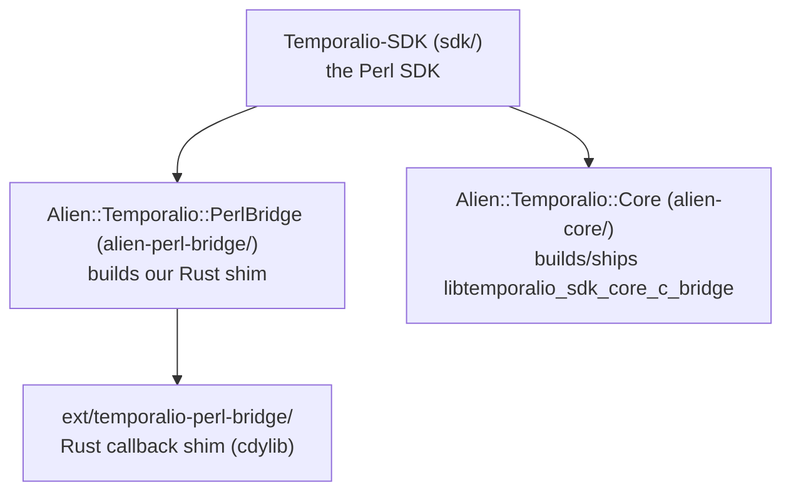

# Temporal SDK for Perl

[](https://github.com/temporalio/sdk-perl/actions/workflows/ci.yml)

A [Temporal](https://temporal.io) SDK for Perl. [Temporal](https://docs.temporal.io)
is a durable execution platform that lets you write applications that recover from
failure by default: your workflow code is plain Perl, but its state and progress are
persisted by the Temporal server, so it survives process crashes, restarts, and
deploys without losing its place.

This SDK drives the Rust `sdk-core` through its C ABI
(`temporalio-sdk-core-c-bridge`) via [FFI::Platypus](https://metacpan.org/pod/FFI::Platypus),
with an async surface built on [Future::AsyncAwait](https://metacpan.org/pod/Future::AsyncAwait)
over [IO::Async](https://metacpan.org/pod/IO::Async). Workflows run in a custom
deterministic scheduler that resolves their futures from server activations rather
than from wall-clock timers.

> **Status: pre-1.0 (v0.2).** Both v0.1 and v0.2 (feature parity with the mature
> SDKs) are implemented: client, worker, sync/async activities, and workflows
> with signals, queries, updates, timers, cancellation, continue-as-new, child
> workflows, external handles, local activities, schedules, Nexus, interceptors,
> and worker hardening. v0.2.0 is feature-complete and verified live against a
> dev server: the unit, replay, and live integration suites are green. The public
> API is pre-1.0 and may still change before a 1.0 release; expect breaking
> changes.

**Contents**

- [Quick Start](#quick-start)
- [Repository layout](#repository-layout)
- [Usage](#usage)
  - [Client](#client)
  - [Workers](#workers)
  - [Workflows](#workflows)
  - [Activities](#activities)
  - [Common types](#common-types)
  - [Telemetry](#telemetry)
  - [Testing](#testing)
- [Not yet supported](#not-yet-supported)
- [Requirements](#requirements)
- [Development](#development)
- [License](#license)

## Quick Start

### Installation

There is no CPAN release yet. Install the three distributions from git, in
dependency order, with [`cpanm`](https://metacpan.org/pod/App::cpanminus):

```bash
cpanm git+https://github.com/temporalio/sdk-perl.git#main/alien-core
cpanm git+https://github.com/temporalio/sdk-perl.git#main/alien-perl-bridge
cpanm git+https://github.com/temporalio/sdk-perl.git#main/sdk
```

The first command builds `sdk-core` from a pinned `sdk-rust` tag and takes a few
minutes (a Rust `stable` toolchain is required). To build against a local
`sdk-rust` checkout instead of fetching the tag, set
`ALIEN_TEMPORALIO_CORE_SDK_RUST_PATH` to its path before installing. See
[Requirements](#requirements) for supported Perl versions and platforms.

### Implementing a Workflow and Activity

Workflows and activities are `feature 'class'` definitions. An **activity** is an
ordinary method — it may do I/O, call services, and fail — marked with `:Defn`:

```perl
# Activities.pm
use v5.38;
use feature 'class';
no warnings 'experimental::class';
use Future::AsyncAwait;
use Temporalio::Activity::Definition;

class Activities :isa(Temporalio::Activity::Definition) {
    async method say_hello :Defn('SayHello') ($name) {
        return "Hello, $name!";
    }
}
1;
```

A **workflow** is deterministic orchestration code. Its `:Run` method is the entry
point; it calls activities (and uses timers, signals, etc.) through the
`Temporalio::Workflow` API:

```perl
# GreetingWorkflow.pm
use v5.38;
use feature 'class';
no warnings 'experimental::class';
use Future::AsyncAwait;
use Temporalio::Workflow;
use Temporalio::Workflow::Definition;

class GreetingWorkflow :isa(Temporalio::Workflow::Definition) {
    async method run :Run('GreetingWorkflow') ($name = 'World') {
        return await Temporalio::Workflow::execute_activity(
            'SayHello',
            args                   => [$name],
            start_to_close_timeout => 30,
        );
    }
}
1;
```

### Running a Worker

A **worker** connects to the server, registers your workflows and activities, and
polls a task queue, executing tasks until it is shut down:

```perl
use v5.38;
use Future::AsyncAwait;
use IO::Async::Loop;
use Temporalio::Runtime;
use Temporalio::Client;
use Temporalio::Worker;
use GreetingWorkflow;
use Activities;

my $loop    = IO::Async::Loop->new;
my $runtime = Temporalio::Runtime->new(loop => $loop);

my $client = $loop->await(
    Temporalio::Client->connect('localhost:7233',
        namespace => 'default', runtime => $runtime)
)->get;

my $worker = Temporalio::Worker->new(
    client     => $client,
    task_queue => 'hello-world',
    workflows  => ['GreetingWorkflow'],
    activities => ['Activities'],
);

# Runs until $worker->shutdown is called (e.g. from a SIGINT handler).
$loop->await($worker->run)->get;
```

### Executing a Workflow

From another process, start the workflow and wait for its result:

```perl
use v5.38;
use IO::Async::Loop;
use Temporalio::Runtime;
use Temporalio::Client;

my $loop    = IO::Async::Loop->new;
my $runtime = Temporalio::Runtime->new(loop => $loop);
my $client  = $loop->await(
    Temporalio::Client->connect('localhost:7233',
        namespace => 'default', runtime => $runtime)
)->get;

my $result = $loop->await(
    $client->execute_workflow('GreetingWorkflow', ['Alice'],
        id => 'hello-world-Alice', task_queue => 'hello-world')
)->get;

say $result;    # Hello, Alice!
```

Complete, runnable versions live in
[`sdk/examples/hello-world/`](sdk/examples/hello-world/) (activities + timer) and
[`sdk/examples/greet-with-signal/`](sdk/examples/greet-with-signal/) (signals +
queries). Each has a separate `worker.pl` and `starter.pl`.

## Repository layout

This is a monorepo of three layered [Dist::Zilla](https://metacpan.org/pod/Dist::Zilla)
distributions plus the Rust callback shim they depend on:



| Path                          | Distribution                    | Role |
|-------------------------------|---------------------------------|------|
| `alien-core/`                 | `Alien::Temporalio::Core`       | Builds/ships `libtemporalio_sdk_core_c_bridge` from a pinned `sdk-rust` tag. |
| `alien-perl-bridge/`          | `Alien::Temporalio::PerlBridge` | Builds our in-tree Rust shim. |
| `sdk/`                        | `Temporalio-SDK`                | The Perl SDK: client, worker, workflows, activities, converters. |
| `ext/temporalio-perl-bridge/` | (Rust crate)                    | Trampolines that marshal sdk-core's Tokio-thread callbacks onto a per-runtime queue the Perl event loop drains — the interpreter is never touched off the main thread. |

Protobuf support is the pure-Perl
[`Protobuf`](https://github.com/MasonEgger/protobuf-perl) distribution: the vendored
proto trees in `sdk/share/proto/` are parsed directly (no `protoc`, no
`libprotobuf`), and message classes are generated at runtime under
`Temporalio::Proto::*`.

## Usage

The asynchronous API returns [`Future`](https://metacpan.org/pod/Future) objects.
Outside a workflow you drive them with your `IO::Async` loop —
`$loop->await($future)->get` — or `await` them inside an
[`async sub`](https://metacpan.org/pod/Future::AsyncAwait). Inside a workflow you
always `await`; the deterministic scheduler — not the event loop — resolves the
futures (see [Workflow logic constraints](#workflow-logic-constraints)).

### Client

A client wraps a single gRPC connection to a Temporal server (or Temporal Cloud)
plus a namespace and a [data converter](#data-conversion). Every client needs a
[`Temporalio::Runtime`](sdk/lib/Temporalio/Runtime.pm), which binds sdk-core to an
`IO::Async::Loop`:

```perl
use Temporalio::Runtime;
use Temporalio::Client;

my $runtime = Temporalio::Runtime->new(loop => $loop);

my $client = $loop->await(Temporalio::Client->connect(
    'localhost:7233',
    namespace => 'default',
    runtime   => $runtime,
))->get;
```

Client-wide retry, keep-alive, and TLS behavior are configured at connect time:

```perl
use Temporalio::Client::RetryConfig;
use Temporalio::Client::KeepAliveConfig;

my $client = $loop->await(Temporalio::Client->connect(
    'localhost:7233',
    namespace  => 'default',
    runtime    => $runtime,
    identity   => 'worker-1@host',                       # default: "<pid>@<hostname>"
    retry      => Temporalio::Client::RetryConfig->new,  # applied to every RPC by core
    keep_alive => Temporalio::Client::KeepAliveConfig->new,
))->get;
```

Once connected you can start, signal-with-start, list, and count workflows, and get
handles to existing ones:

```perl
# Start and get a handle (does not wait for the result):
my $handle = $loop->await($client->start_workflow(
    'GreetingWorkflow', ['Alice'],
    id         => 'wf-alice',
    task_queue => 'hello-world',
))->get;

# Start-or-attach to an existing run:
my $handle = $client->get_workflow_handle('wf-alice');

# List / count via a Visibility query:
my $iter = $client->list_workflows(q{WorkflowType = 'GreetingWorkflow'});
my $n    = $loop->await($client->count_workflows(q{WorkflowType = 'GreetingWorkflow'}))->get;
```

`start_workflow` accepts the full set of start options: `id_reuse_policy`,
`id_conflict_policy`, `execution_timeout`, `run_timeout`, `task_timeout`,
`start_delay`, `cron_schedule`, `retry_policy`, `priority`, `memo`,
`search_attributes`, and `headers`. `execute_workflow` is the convenience wrapper
that starts and awaits the result in one call.

#### Temporal Cloud (mTLS and API keys)

Connect to Temporal Cloud with **mTLS** by supplying client certificates via
[`TlsConfig`](sdk/lib/Temporalio/Client/TlsConfig.pm):

```perl
use Temporalio::Client::TlsConfig;
use Path::Tiny qw(path);

my $client = $loop->await(Temporalio::Client->connect(
    'my-namespace.a1b2c.tmprl.cloud:7233',
    namespace => 'my-namespace.a1b2c',
    runtime   => $runtime,
    tls       => Temporalio::Client::TlsConfig->new(
        client_cert         => path('client.pem')->slurp_raw,
        client_private_key  => path('client.key')->slurp_raw,
    ),
))->get;
```

Or connect with an **API key** (TLS is enabled automatically). The key can be
rotated on a live connection:

```perl
my $client = $loop->await(Temporalio::Client->connect(
    'my-namespace.a1b2c.tmprl.cloud:7233',
    namespace => 'my-namespace.a1b2c',
    runtime   => $runtime,
    api_key   => $api_key,
    tls       => 1,
))->get;

$client->update_api_key($rotated_key);   # takes effect on subsequent RPCs
```

#### Data conversion

Every payload that crosses the boundary — workflow/activity arguments and results,
signal/query payloads, memos, and failures — passes through a
[`Temporalio::Converter::Data`](sdk/lib/Temporalio/Converter/Data.pm). The default
converter encodes values with the five standard Temporal payload encodings, tried
in spec order:

| Encoding (`encoding` metadata) | Handles |
|--------------------------------|---------|
| `binary/null`                  | `undef` |
| `binary/plain`                 | raw bytes ([`Temporalio::Payload::RawBytes`](sdk/lib/Temporalio/Payload/RawBytes.pm)) |
| `json/protobuf`                | protobuf messages as JSON |
| `binary/protobuf`              | protobuf messages as bytes ([`Temporalio::Payload::BinaryProto`](sdk/lib/Temporalio/Payload/BinaryProto.pm)) |
| `json/plain`                   | everything else, via JSON |

To transform payload bytes on the wire — for example to **compress or encrypt**
them — implement a [`Temporalio::Converter::PayloadCodec`](sdk/lib/Temporalio/Converter/PayloadCodec.pm)
(an async `encode`/`decode` pair over arrays of payloads) and pass a custom data
converter at connect time:

```perl
use Temporalio::Converter::Data;

my $client = $loop->await(Temporalio::Client->connect(
    'localhost:7233',
    namespace      => 'default',
    runtime        => $runtime,
    data_converter => Temporalio::Converter::Data->new(
        payload_codecs => [ MyEncryptionCodec->new ],
    ),
))->get;
```

Codecs run outermost-first on encode and in reverse on decode, including for the
payloads nested inside failure protos.

### Workers

A [`Temporalio::Worker`](sdk/lib/Temporalio/Worker.pm) hosts workflow and activity
execution for one task queue. `run` returns a `Future` that stays pending until
`shutdown` is called, at which point the poll loops drain in-flight tasks and the
worker frees its sdk-core resources:

```perl
my $worker = Temporalio::Worker->new(
    client     => $client,
    task_queue => 'hello-world',
    workflows  => ['GreetingWorkflow'],
    activities => ['Activities'],

    # Tuning (defaults shown):
    max_concurrent_workflow_tasks => 100,
    max_concurrent_activities     => 100,
    sync_activity_workers         => 4,    # fork-pool size for sync activities
    graceful_shutdown_period      => 0,    # seconds to wait before hard-cancelling activities
);

# Stop cleanly on a signal:
$loop->watch_signal(INT => sub { $worker->shutdown });
$loop->await($worker->run)->get;
```

A single worker drives **both** an activity poll loop and a workflow poll loop
concurrently on the event loop. Workflow runs are cached per run id and evicted on
the server's instruction.

### Workflows

#### Definition

A workflow is a class extending
[`Temporalio::Workflow::Definition`](sdk/lib/Temporalio/Workflow/Definition.pm).
Method attributes mark the entry point and message handlers:

| Attribute            | Meaning |
|----------------------|---------|
| `:Run('Name')`       | The workflow entry point. Exactly one per class. |
| `:Signal('name')`    | A signal handler — an asynchronous message that may mutate state. |
| `:Query('name')`     | A query handler — read-only; must not mutate state or issue commands. |
| `:Init`              | Runs before `:Run` to initialize fields from the workflow input. |

```perl
class Greeting :isa(Temporalio::Workflow::Definition) {
    field $name = '';

    async method run :Run('Greeting') () {
        await Temporalio::Workflow::wait_condition(sub { length $name });
        return "Hello, $name!";
    }

    method set_name   :Signal('setName')    ($value) { $name = $value; return }
    method current    :Query('currentName') ()       { return $name }
}
```

#### Running workflows

Client-side, a [`Temporalio::Client::WorkflowHandle`](sdk/lib/Temporalio/Client/WorkflowHandle.pm)
controls a started workflow:

```perl
my $handle = $loop->await($client->start_workflow(
    'Greeting', [], id => 'greet-1', task_queue => 'q'))->get;

my $state  = $loop->await($handle->query('currentName'))->get;  # read in-flight state
$loop->await($handle->signal('setName', ['Ada']))->get;         # send a signal
my $result = $loop->await($handle->result)->get;                # await completion → "Hello, Ada!"
```

The handle also supports `describe`, `cancel`, `terminate`, and
`fetch_history_events`. `result` maps the workflow's terminal event to a value or a
typed exception (see [Workflow exceptions](#workflow-exceptions)).

#### Invoking activities

Inside workflow code, call activities through the `Temporalio::Workflow` API.
`execute_activity` awaits the result; `start_activity` returns a future you can hold
and combine:

```perl
my $greeting = await Temporalio::Workflow::execute_activity(
    'SayHello',
    args                   => [$name],
    start_to_close_timeout => 30,            # one of the four activity timeouts
    retry_policy           => $retry_policy, # optional; defaults to server policy
);

# Or start without awaiting, to run activities concurrently:
my $f1 = Temporalio::Workflow::start_activity('A', args => [1], start_to_close_timeout => 10);
my $f2 = Temporalio::Workflow::start_activity('B', args => [2], start_to_close_timeout => 10);
my ($a, $b) = await Future->needs_all($f1, $f2);
```

Supported options include the four timeouts (`start_to_close_timeout`,
`schedule_to_close_timeout`, `schedule_to_start_timeout`, `heartbeat_timeout`),
`retry_policy`, `task_queue`, `activity_id`, and `cancellation_type`.

#### Timers and conditions

`sleep` and `start_timer` create durable, replay-safe timers; `wait_condition`
blocks until a predicate becomes true, re-checked after every activation (so it
wakes when a signal or activity result changes state). Both accept an optional
timeout:

```perl
await Temporalio::Workflow::sleep(60);                       # durable 60s timer

my $signalled = await Temporalio::Workflow::wait_condition(
    sub { $self->ready }, timeout => 300,                    # false if it times out
);
```

#### Workflow futures and concurrency

Workflows are single-threaded and deterministic, but you can run operations
concurrently by holding their futures and combining them with the standard
[`Future`](https://metacpan.org/pod/Future) combinators (`needs_all`,
`wait_any`, …). A common pattern is racing work against a timeout timer:

```perl
my $work  = Temporalio::Workflow::start_activity('Slow', args => [], start_to_close_timeout => 600);
my $timer = Temporalio::Workflow::sleep(30);
my $first = await Future->wait_any($work, $timer);
```

#### Continue-as-new

To start a fresh execution with a clean event history (for long-running or
unbounded workflows), continue-as-new. It throws a control-flow signal that ends
the current run:

```perl
await Temporalio::Workflow::continue_as_new('Greeting', args => [$next_input]);
```

#### Deterministic time, randomness, and logging

Workflow code must be deterministic, so it must never read the system clock or use
ambient randomness. The `Temporalio::Workflow` API provides the only legal sources,
all driven from the activation:

```perl
my $now    = Temporalio::Workflow::now;            # deterministic wall time
my $r      = Temporalio::Workflow::random;         # seeded, replay-stable PRNG
my $replay = Temporalio::Workflow::is_replaying;   # true while replaying history
my $info   = Temporalio::Workflow::info;           # workflow id, run id, attempt, …
Temporalio::Workflow::logger->info('processing', { name => $name });  # replay-aware
```

The workflow logger suppresses duplicate lines during replay automatically.

#### Versioning (patching)

To change workflow code without breaking in-flight executions, gate the new branch
with a patch marker. `patched` returns true for new executions and for histories
that recorded the patch; `deprecate_patch` retires the marker once all old
executions have drained:

```perl
if (Temporalio::Workflow::patched('use-v2-activity')) {
    await Temporalio::Workflow::execute_activity('V2', ...);
} else {
    await Temporalio::Workflow::execute_activity('V1', ...);
}
```

#### Workflow exceptions

`$handle->result` raises a typed exception when a workflow does not complete
successfully. All inherit from [`Temporalio::Exception`](sdk/lib/Temporalio/Exception.pm):

| Outcome                | Exception |
|------------------------|-----------|
| Workflow failed        | [`Temporalio::Exception::WorkflowFailure`](sdk/lib/Temporalio/Exception/WorkflowFailure.pm) wrapping the cause |
| Application error      | [`Temporalio::Exception::Application`](sdk/lib/Temporalio/Exception/Application.pm) (carries an error `type` and `non_retryable`) |
| Activity failure       | [`Temporalio::Exception::Activity`](sdk/lib/Temporalio/Exception/Activity.pm) |
| Cancelled / Terminated | [`Cancelled`](sdk/lib/Temporalio/Exception/Cancelled.pm) / [`Terminated`](sdk/lib/Temporalio/Exception/Terminated.pm) |
| Timed out              | [`Temporalio::Exception::Timeout`](sdk/lib/Temporalio/Exception/Timeout.pm) |

To fail a workflow or activity with a specific, non-retryable error type, throw a
`Temporalio::Exception::Application`. Failures round-trip through the failure
converter, preserving the cause chain.

#### Workflow logic constraints

Workflow code is replayed to reconstruct state, so it **must be deterministic**:

- Use `Temporalio::Workflow::now`/`random`, never `time`, `localtime`, or `rand`.
- Never do I/O, sleep with `IO::Async`/`sleep`, or call out to the network directly
  — put that in an activity.
- Only `await` futures created by the `Temporalio::Workflow` API; awaiting an
  arbitrary event-loop future breaks determinism.
- Use `Syntax::Keyword::Dynamically`, not `local`, for dynamic scope across an
  `await`.

Non-deterministic divergence during replay is detected and surfaced as
[`Temporalio::Exception::Nondeterminism`](sdk/lib/Temporalio/Exception/Nondeterminism.pm).

#### Replay

You can verify workflow code against recorded histories without a server using
[`Temporalio::Test::WorkflowReplay`](sdk/lib/Temporalio/Test/WorkflowReplay.pm),
useful for catching non-determinism introduced by a code change in CI.
`replay_history` pushes a real `temporal.api.history.v1.History` through sdk-core's replayer, which compares every command the workflow emits against the recorded events and raises `Temporalio::Exception::Nondeterminism` on divergence.
`replay_workflow` and `replay_workflows` are the public surface over the same core replayer: they take [`Temporalio::Client::WorkflowHistory`](sdk/lib/Temporalio/Client/WorkflowHistory.pm) objects (fetched, or loaded from a CLI/UI JSON download via `from_json`) and return per-history results, so one nondeterministic history in a batch fails its own result while the rest still replay.
`push_activation` drives the deterministic runner directly with hand-built activations and returns the emitted commands; it checks command emission, not history consistency.
The [replay tests](sdk/t/replay/) exercise these paths.

### Activities

#### Definition

An activity is a method marked `:Defn('Name')` on a class extending
[`Temporalio::Activity::Definition`](sdk/lib/Temporalio/Activity/Definition.pm).
Activities may be **async** (they `await` and run on the event loop) or **sync**
(ordinary blocking subs):

```perl
class Activities :isa(Temporalio::Activity::Definition) {
    # Async: runs on the main event loop, awaits other futures.
    async method fetch :Defn('Fetch') ($url) { return await $self->http_get($url) }

    # Sync: ordinary blocking code, run in a fork pool (see below).
    method crunch :Defn('Crunch') ($data) { return expensive_pure_perl($data) }
}
```

#### Activity context

Inside an activity, `Temporalio::Activity` exposes the execution context — metadata,
heartbeating, and the cancellation token:

```perl
use Temporalio::Activity;

my $info = Temporalio::Activity::info;          # activity id/type, workflow id/run id, attempt, …
Temporalio::Activity::heartbeat('progress', 42); # report liveness + checkpoint details
```

#### Heartbeating and cancellation

Long-running activities should `heartbeat` to prove liveness; the details are
returned to the next attempt after a failure. An activity learns it has been
cancelled (workflow cancelled, timed out, or worker shutting down) through the
cancellation token on its context
([`Temporalio::Activity::Context`](sdk/lib/Temporalio/Activity/Context.pm)`->cancellation`),
a [`Temporalio::Cancellation`](sdk/lib/Temporalio/Cancellation.pm) it can poll or
await to stop cooperatively.

#### Concurrency and the fork pool

Async activities run concurrently on the worker's event loop. **Sync** activities
run in an `IO::Async::Function` fork pool (sized by `sync_activity_workers`) so that
CPU-bound or blocking code never stalls the loop; forked children close inherited
file descriptors and relay heartbeats back to the parent. Concurrency caps are set
per worker via `max_concurrent_activities`.

### Common types

[`Temporalio::Common::RetryPolicy`](sdk/lib/Temporalio/Common/RetryPolicy.pm)
configures retry behavior for workflows and activities (defaults match the Temporal
spec):

```perl
use Temporalio::Common::RetryPolicy;

my $retry = Temporalio::Common::RetryPolicy->new(
    initial_interval          => 1,
    backoff_coefficient       => 2.0,
    maximum_interval          => 60,
    maximum_attempts          => 0,            # 0 = unlimited
    non_retryable_error_types => ['FatalError'],
);
```

[Typed search attributes](sdk/lib/Temporalio/Common/TypedSearchAttributes.pm) give
type-safe Visibility keys, and
[`Temporalio::Common::Priority`](sdk/lib/Temporalio/Common/Priority.pm) sets task
priority:

```perl
use Temporalio::Common::SearchAttributeKey;
use Temporalio::Common::TypedSearchAttributes;

my $key = Temporalio::Common::SearchAttributeKey->keyword('CustomerId');
my $sa  = Temporalio::Common::TypedSearchAttributes->new([ [ $key => 'c-123' ] ]);

$loop->await($client->start_workflow('Greeting', [],
    id => 'wf', task_queue => 'q', search_attributes => $sa))->get;
```

### Telemetry

Telemetry is configured once on the runtime, via
[`Temporalio::Runtime::TelemetryConfig`](sdk/lib/Temporalio/Runtime/TelemetryConfig.pm).

#### Metrics

Export sdk-core metrics with a **Prometheus** scrape endpoint or an **OpenTelemetry**
OTLP exporter:

```perl
use Temporalio::Runtime;
use Temporalio::Runtime::TelemetryConfig;
use Temporalio::Runtime::PrometheusConfig;

my $runtime = Temporalio::Runtime->new(
    loop      => $loop,
    telemetry => Temporalio::Runtime::TelemetryConfig->new(
        metrics => Temporalio::Runtime::PrometheusConfig->new(
            bind_address => '0.0.0.0:9090',
        ),
    ),
);
```

Swap in [`Temporalio::Runtime::OpenTelemetryConfig`](sdk/lib/Temporalio/Runtime/OpenTelemetryConfig.pm)
(with an OTLP `url`) for push-based OTel metrics. `global_tags`, `metric_prefix`,
and `attach_service_name` are also configurable.

#### Logging

Core's structured logging is configured with
[`LoggingConfig`](sdk/lib/Temporalio/Runtime/LoggingConfig.pm) and a
[`LoggingFilter`](sdk/lib/Temporalio/Runtime/LoggingFilter.pm) on the same
`TelemetryConfig`. Inside workflows, use the replay-aware
`Temporalio::Workflow::logger` (see [above](#deterministic-time-randomness-and-logging)).

### Testing

[`Temporalio::Test::DevServer`](sdk/lib/Temporalio/Test/DevServer.pm) boots an
ephemeral Temporal dev server (via the [`temporal`
CLI](https://docs.temporal.io/cli)) for integration tests, and
[`Temporalio::Test::Worker`](sdk/lib/Temporalio/Test/Worker.pm) helps stand up a
worker in-process. [`Temporalio::Test::WorkflowReplay`](sdk/lib/Temporalio/Test/WorkflowReplay.pm)
drives the deterministic runner with hand-built or recorded histories — no server
needed. The suite is split into `t/unit/`, `t/replay/`, and `t/integration/`;
integration tests `skip_all` when the dev server is unavailable, so a green offline
run is expected.

## Not yet supported

The v0.1 and v0.2 feature set is implemented. The following are out of scope for
now:

- **A time-skipping test environment.** Workflow tests use the deterministic
  replay harness (`Temporalio::Test::WorkflowReplay`) or a real dev server
  (`Temporalio::Test::DevServer`); there is no time-skipping `WorkflowEnvironment`.
- **Windows.** The build targets Linux and other Unix-like platforms (the
  callback bridge uses `eventfd` on Linux and a pipe elsewhere).
- **CPAN distribution.** The three distributions are not published to CPAN yet;
  install from this repository.

## Requirements

- **Perl 5.38.0 or newer.** This is where `feature 'class'` landed; the SDK uses it
  pervasively. 5.38 ships in Ubuntu 24.04 LTS and Alpine 3.20. CI runs 5.38, 5.40,
  and 5.42.
- **A Rust toolchain** (`stable`, 1.80+) via [rustup](https://rustup.rs), to build
  the native libraries at install time.
- A C toolchain (for `FFI::Platypus` and the cdylib builds).

### Platform notes

- **Linux** is the primary target. The callback shim uses `eventfd`; other
  platforms use a self-pipe.
- **RHEL / CentOS Stream 9** ship Perl 5.32 (frozen, EOL 2032) — too old. Use
  [Software Collections](https://www.softwarecollections.org/) or
  [perlbrew](https://perlbrew.pl/) to get a 5.38+ Perl.
- **macOS** system Perl is 5.34 and Apple has signalled it will be removed. Install
  a current Perl with `perlbrew`, `plenv`, or Homebrew (`brew install perl`). Both
  Intel (x86_64) and Apple Silicon (arm64) are supported.
- **Windows** is best-effort (a non-blocking CI job runs Strawberry Perl); it is not
  yet a supported target.

## Development

```bash
cd sdk && prove -lj4 t                          # full Perl test suite (unit/replay/integration)
cd sdk && prove -lj4 xt                          # author tests (POD coverage + syntax)
cd ext/temporalio-perl-bridge && cargo test      # Rust shim tests
dzil test                                        # per-distribution check (run in each dist dir)
```

- `ALIEN_TEMPORALIO_CORE_SDK_RUST_PATH=<sdk-rust checkout>` makes
  `Alien::Temporalio::Core` build from a local tree instead of fetching the pinned
  tag.
- Integration tests `skip_all` when the dev server is unavailable.

Every public class ships hand-written POD; after installing, run
`perldoc Temporalio::Client` (or `::Worker`, `::Workflow`, `::Activity`, …). The
implementation contract is [`spec.md`](.ai-sessions/v1/spec.md); the TDD roadmap
is [`plan.md`](.ai-sessions/v1/plan.md).

## License

MIT. Copyright Temporal Technologies Inc.
