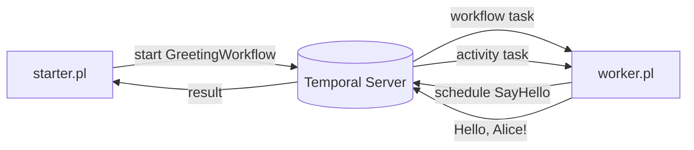

# Hello, World

The smallest end-to-end Temporal Perl SDK example: one workflow that calls one
activity. A worker polls a task queue and executes both; a starter kicks off the
workflow and prints its result.

## Layout

```
hello-world/
├── lib/
│   └── HelloWorld/
│       ├── GreetingWorkflow.pm   # the workflow (calls the activity, returns its result)
│       └── Activities.pm         # the SayHello activity
├── worker.pl                     # runs the worker (polls the task queue)
└── starter.pl                    # starts the workflow and prints "Hello, <name>!"
```

## Run it

1. Start a local Temporal server (the `temporal` CLI's dev server):

   ```bash
   temporal server start-dev
   ```

2. In one terminal, start the worker. It connects to the server, registers the
   workflow and activity, and polls the `hello-world` task queue until you stop
   it with Ctrl-C:

   ```bash
   perl -Ilib worker.pl
   ```

   (`-Ilib` puts `examples/hello-world/lib` on `@INC`; the SDK itself must
   already be installed, or add its `lib` too.)

3. In another terminal, start a workflow and wait for its result:

   ```bash
   perl -Ilib starter.pl Alice
   # -> Hello, Alice!
   ```

   The name argument is optional (defaults to `Temporal`).

## Configuration

All three scripts honor the same environment overrides:

| Variable               | Default            | Meaning                         |
|------------------------|--------------------|---------------------------------|
| `TEMPORAL_ADDRESS`     | `localhost:7233`   | server `host:port`              |
| `TEMPORAL_NAMESPACE`   | `default`          | namespace                       |
| `TEMPORAL_TASK_QUEUE`  | `hello-world`      | task queue the worker polls     |

## How it fits together



The workflow code is deterministic — it never does I/O itself. It schedules the
`SayHello` activity and awaits the result; the activity is where real side
effects would live. Both run inside the worker.
